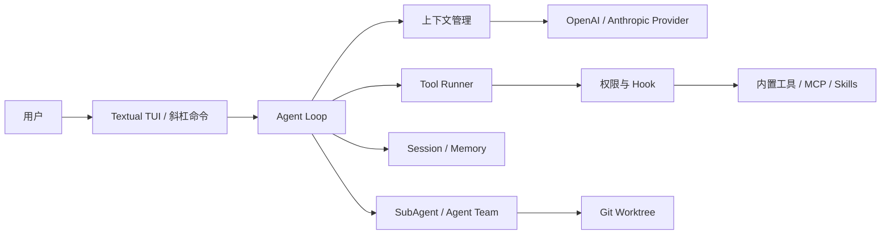

# NovaCode

[](https://github.com/LouisHyh1/NovaCode/actions/workflows/tests.yml)

NovaCode 是一个使用 Python 构建的终端 AI 编程助手，也是一个面向 Agent Runtime 的工程实践项目。它以可运行、可理解的实现串联模型调用、工具执行、权限控制、上下文管理、持久化会话与多 Agent 协作，让模型能够在真实代码库中分析问题、修改文件、执行命令并持续完成任务。

> 当前项目处于持续开发阶段，适合学习 Agent Runtime、验证工程设计和进行个人开发实验，尚未作为生产级安全沙箱发布。

## 核心能力

- **Agent Loop**：流式接收模型输出，执行工具调用，将结果写回上下文并循环至任务结束。
- **代码工具**：内置文件读取、写入、精确编辑、Glob、Grep 和跨平台命令执行工具；只读工具可并发执行。
- **模型接入**：支持 Anthropic 与 OpenAI 协议，可通过 `base_url` 连接兼容服务。
- **权限控制**：提供 `default`、`acceptEdits`、`plan` 和 `bypassPermissions` 四种模式，并对敏感文件、越界路径与危险命令执行内建检查。
- **上下文管理**：自动截断过大的工具结果，支持手动、自动和紧急上下文压缩，以及超长请求恢复。
- **会话与记忆**：持久化会话并通过 `/resume` 恢复；区分用户、反馈、项目和参考资料四类长期记忆。
- **扩展机制**：支持项目级与用户级 Instructions、Skills、生命周期 Hooks，以及 stdio/HTTP 两种 MCP Server。
- **多 Agent 协作**：支持 SubAgent、后台任务、Agent Team、消息传递、任务依赖和 Git Worktree 隔离。
- **跨平台运行**：使用同一套 Python 代码运行于 Windows 与 Linux，并通过双平台 CI 持续验证。

## 运行架构



主入口位于 `src/novacode/cli.py`。CLI 负责加载配置并装配 Provider、工具注册表、权限引擎、Hook、MCP、Session、Memory、SubAgent 与 Team；`Agent` 负责模型—工具循环，`ToolRunner` 统一处理权限审批、Hook 分发、并发执行和结果回传。

## 环境要求

- Python 3.12（由 `uv` 根据 `.python-version` 自动安装）
- [uv](https://docs.astral.sh/uv/)
- Windows 10/11，或支持 UTF-8 的 Linux / WSL 终端
- 至少一个 Anthropic 或 OpenAI 协议的模型服务

## 快速开始

### 1. 克隆并安装

```sh
git clone https://github.com/LouisHyh1/NovaCode.git
cd NovaCode
uv sync --locked
```

### 2. 配置模型

在项目目录创建 `.novacode/config.yaml`。该文件已被 Git 忽略，建议通过环境变量提供密钥：

```yaml
providers:
  - name: default
    protocol: openai
    api_key: ${OPENAI_API_KEY}
    model: your-model
    # 使用兼容服务时取消下面一行的注释
    # base_url: https://your-provider.example/v1
```

设置环境变量：

```powershell
# Windows PowerShell
$env:OPENAI_API_KEY = "your-api-key"
```

```sh
# Linux / WSL
export OPENAI_API_KEY="your-api-key"
```

Provider 配置按“项目级 `.novacode/config.yaml` 优先、用户级 `~/.novacode/config.yaml` 兜底”的顺序加载。

### 3. 启动

```sh
uv run nova
```

```sh
uv run nova --version
uv run nova --help
```

## 常用命令

| 命令 | 作用 |
| --- | --- |
| `/plan` | 切换到只允许只读工具的计划模式 |
| `/do` | 执行已经确认的计划 |
| `/compact` | 立即压缩当前上下文 |
| `/resume` | 恢复历史会话 |
| `/memory` | 查看已加载的记忆 |
| `/skill` | 列出、查看或重载 Skill |
| `/hooks` | 查看已加载的生命周期 Hook |
| `/worktree` | 管理隔离的 Git Worktree |
| `/team` | 管理 Agent Team |
| `/status` | 查看当前模型、模式与运行状态 |
| `/help` | 查看全部命令 |

## MCP 配置

MCP Server 可以与 Provider 共用 `.novacode/config.yaml`。下面示例注册一个 stdio Server：

```yaml
providers:
  - name: default
    protocol: openai
    api_key: ${OPENAI_API_KEY}
    model: your-model

mcp_servers:
  example:
    type: stdio
    command: your-mcp-command
    args: ["--stdio"]
    env:
      EXAMPLE_API_KEY: ${EXAMPLE_API_KEY}
```

项目也支持 HTTP MCP Server；成功连接后，远端工具会以 `mcp__<server>__<tool>` 的名称注册到 Agent。

## 扩展位置

| 能力 | 项目级位置 | 用户级位置 |
| --- | --- | --- |
| Instructions | `NOVACODE.md`、`.novacode/NOVACODE.md`、`NOVACODE.local.md` | `~/.novacode/NOVACODE.md` |
| Skills | `.novacode/skills/` | `~/.novacode/skills/` |
| Hooks | `.novacode/hooks.yaml` | `~/.novacode/hooks.yaml` |
| 权限规则 | `.novacode/settings.yaml`、`.novacode/settings.local.yaml` | `~/.novacode/settings.yaml` |
| Memory | `.novacode/memory/` | `~/.novacode/memory/` |

## Shell 差异

工具协议中的名称保持为 `bash`，以兼容已有会话和模型工具调用；实际执行器会按平台选择 Shell：

- Windows：`cmd.exe /C`，例如 `dir`、`set NAME=value`
- Linux：`/bin/sh -c`，例如 `ls`、`export NAME=value`

模型会从环境提示中的 `Platform` 字段获知当前平台。项目路径应通过 `pathlib.Path` 或 `os.path` 处理，不应在 Python 代码中硬编码平台路径。

如果同一份 WSL 检出目录还会通过 Windows 的 `\\wsl.localhost\...` 访问，不要跨平台共用虚拟环境。Windows 侧可将环境放到本机 NTFS 目录：

```powershell
$repo = (Get-Location).ProviderPath
$env:UV_PROJECT_ENVIRONMENT = "$env:LOCALAPPDATA\NovaCode\venv"
uv --directory $repo sync --locked
uv --directory $repo run nova
```

## 开发与验证

```sh
uv sync --locked
uv run --locked pytest -q
uv run --locked ruff check src tests
uv run --locked ruff format --check src tests
uv run --locked python scripts/check_boundaries.py
```

GitHub Actions 会在 `ubuntu-latest` 和 `windows-latest` 上执行锁文件检查、完整测试、Lint、格式检查、架构边界检查和非交互式启动检查。

## 安全边界

NovaCode 的权限系统提供应用层审批、项目路径约束、敏感文件保护和危险命令黑名单，但它不是操作系统级沙箱。请仅在可信代码库和可恢复的 Git 工作区中运行；启用 `bypassPermissions` 前，应确认当前任务及命令的影响范围。
