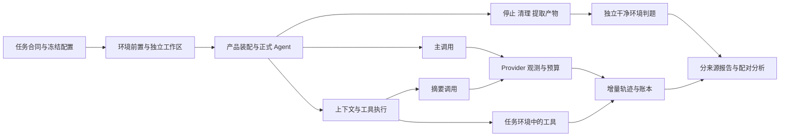

## Context

动机和已确认范围见 [proposal.md](proposal.md)。本设计依据 2026-10-09 的源码和现行 OpenSpec，不以项目 `docs/` 为事实来源。下列现状用于解释前置工作，不表示已完成评测。

源码观察基线为Git commit `287dd45fe7e28702049f9674e0f2d94fbcaf5b45`，项目版本0.1.24；它仅标识本轮审查，未来正式冻结必须重新记录实施后的实际源码树、依赖和策略身份。

| 当前事实 | 源码证据 | 对设计的约束 |
|---|---|---|
| 非交互完成接口复用主 ReAct 循环 | `src/novacode/agent/__init__.py` 的 `run_to_completion()` | 复用现有 Agent，不创建第二套执行引擎 |
| thinking配置与实际请求不完全等价 | `llm/anthropic_provider.py` 在无工具历史时发送thinking及2048预算，输出上限4096；客户端未显式设置重试 | 冻结适配规则并逐请求记录实际参数，处理SDK隐藏尝试 |
| 自动上下文管理无统一关闭策略 | `agent/context_manager.py` 的 `prepare()`；Agent 自动、手动与紧急入口；`session/service.py` 恢复入口 | 开关必须覆盖共享事务及各调用方的状态处理 |
| Layer 2 摘要直接调用 Provider，未消费 usage | `compact/layer2.py` 的 `summarize_once()` | 在 Provider 边界记录费用，不能只累加主 Agent 事件 |
| 工具定义全量导出且 Agent 当前每个 Run 初始取一次 | `tool/__init__.py` 的 `definitions()`；Agent 的 `_tool_definitions()` 与 `run()` | 实现独立曝光状态与每轮定义刷新 |
| 默认注册六个基础工具，CLI 另注册 Memory、Team、Agent 和 MCP | `tool/__init__.py` 的 `new_default_registry()`；`cli.py` 装配 | 基础集合复用现有工具；主集禁用辅助角色，按允许集合过滤其余能力 |
| 工具事件缺少调用关联标识，参数只有预览 | `agent/tool_runner.py` 与 Agent 的 `ToolEvent` | 增补可选关联字段，不能依名称或80字符预览还原并发 |
| 只读工具真实并行执行 | `agent/tool_runner.py` 的 `run()` | 三种实验配置均保留该策略，本 change 不做并行消融 |

只读环境检查发现 WSL 可见 CPU 为 4、内存 5927 MiB、Swap 2048 MiB；Docker 客户端存在，但当前用户访问 socket 被拒绝，daemon 状态未知。官方给出的每实例 4 CPU、16 GB RAM 是资源估算，不能当作所有 Python 题的硬性最低值，也不能据当前容量承诺全部候选可运行。[官方资源与有效性核验说明](https://github.com/microsoft/SWE-bench-Live/blob/main/evaluation/README.md#run-gold-patch)

## Goals / Non-Goals

**Goals:**

- 将真实模型任务执行、业务验收、运行终止和成本账本分开，使失败可定位、实验可重放、报告可复核。
- 用尽量少的生产改动补齐压缩开关、Schema 曝光和观测能力，保留现行模块职责、权限边界及 Provider 单一所有者。
- 将候选、已入库任务、冻结计划和实际运行分别管理，明确“规划完成”与“题库可执行”的区别。

**Non-Goals:**

- 首版不建设分布式调度平台、数据库服务或交互评测看板；账本使用文件，调度和统计优先标准库。
- 主集不使用人工辅助、LLM 判题、子 Agent、长期记忆迁移或跨平台混合成绩；这些能力进入独立专项验收。
- 不延迟 MCP 连接，不用静态删工具充当按需 Schema，不研究只读工具并行的开关。
- 不提交官方榜单、不宣称零污染、生产就绪或普遍优于其他助手；本轮不执行实现和实验。

## Decisions

### 1. 自动化驱动正式Agent，外围完成编排与判题

建议以 `python -m novacode.evaluation` 作为独立入口，保持普通 `nova` 的交互职责。入口准备任务环境、构造产品组件、驱动现有 `Agent.run()` 或 `run_to_completion()`、收尾并提取产物；固定多轮专项脚本执行多个 Agent Run，但合计为一次 Evaluation Run。取消和预算需要完整事件及外层任务控制，不能仅依据返回字符串判断成功。

共享装配只提取 CLI 已有的必要初始化与关闭步骤，不重新引入被删除的 SessionController、TurnEngine、runtime/ports 或额外生命周期协调层。核心只接收策略和观测回调，不导入 evaluation。替代方案是全部经 TUI 执行，成本更高且故障混入界面状态；另造简化 Agent 会破坏行为等价性，因此不采用。

### 2. Live保持官方环境，Agent与目标项目解释器分离

Live 的代码、文件操作、搜索和命令必须在对应实例容器内生效。首选在任务容器中以独立 Python 3.12+ 运行环境运行正式 NovaCode，目标项目继续使用原镜像的解释器和依赖；为 Agent 安装运行依赖不能覆盖目标环境，命令路径必须经验收确认。外部进程只负责公开输入、资源监控和结果收集，不把 Docker socket、隐藏判题目录或参考补丁暴露给 Agent。

前置阶段先用一个代表镜像证明独立 Agent 运行环境可部署、六个文件与命令工具看到同一个 `/testbed`、目标测试没有被 Agent 安装步骤改变。若某镜像无法满足，按环境资格规则排除并补选；不能把命令偷偷改到 WSL 主机跑而仍称官方环境结果。本阶段不引入远程工具 RPC 或重写六个工具，容器适配成本和可运行覆盖需实测后报告。

自建题同样使用独立任务目录或容器，隐藏验收由外部干净副本完成。只读辅助工具采用本地固定业务记录，工具实现可以覆盖非基础内置和 MCP 两种注册路径；服务本身的准备时间单列，MCP 两模式都预先建立连接。

### 3. 主集冻结单主Agent及外部状态

任务配置固定工具允许集合、权限规则、通用指令、Hook 配置、Session 初始状态和模型参数；不加载操作者真实用户记忆、历史 Session 或当前项目中的规划文档。主集不注册可执行的 Team、子 Agent、记忆治理任务；或在两模式一致的允许集合中排除它们，不能仅对某实验组隐藏。

无人辅助采用显式冻结授权与正常权限检查；未预授权的 Ask 确定性拒绝并记录，不静默升级权限。应用需要的内部状态仍放在任务根 `.novacode/`，符合现行 Workspace 规范；判题器、参考补丁和其他运行状态由执行环境之外的评测进程拥有。产品配置只输出白名单元数据，不写 API key、认证头或完整用户配置。

### 4. 统一压缩策略置于现有上下文事务

拟新增布尔配置 `features.context_compression`，缺省为 true。这是后续实现字段，当前配置解析器尚不支持。`ContextManager.prepare()` 是统一策略入口：关闭时保留原消息、返回真实无变化及禁用原因；不调用 Layer 1、Layer 2 或摘要裁剪恢复，不产生摘要 Hook 和 compaction 记录。

Agent 自动、紧急、手动、Session 恢复和辅助角色装配必须传递同一策略；调用方依据实际结果展示禁用、保留历史或拒绝不兼容恢复，不能只加一处自动摘要 guard 后让其他入口继续压缩。默认开启时仍由原模块更新锚点和 Hook。工具自身截断、搜索输出预算和模型窗口三组保持一致，关闭压缩并不代表无限工具输出。

### 5. Schema曝光独立于注册和权限

拟新增布尔配置 `features.progressive_tool_schema`，产品缺省 false，保持全量曝光；实验 `full` 与 `no-compression` 显式设 true。策略适用于所有合格的非基础内置与 MCP 工具。初始基础集合建议为现有六个核心工具与新增 `discover_tools`；先导阶段可按预定职责审查调整，正式前冻结，并在 eager 组也提供同一个发现入口，保证工具能力集合相同。

曝光状态属于一个会话或独立 Evaluation Run，不写到共享 Registry；固定多轮脚本内保留，独立重复间重置。发现按名称精确匹配、规范化词项和描述匹配执行确定排序与有界返回，首版不加 embedding、额外模型调用或语义服务。候选目录仅含允许集合中的名称和简短职责，实际目录输入成本也进入 Token 账本。

发现返回完整 Schema，并将其加入下一轮可见集合；Agent 每轮重新生成当前定义，不再只在 Run 开始取一次。ToolRunner 在保持现有 Hook 与权限检查的同时对未曝光调用给出明确错误；发现不会执行目标工具、扩张允许集合或打开新连接。重复发现幂等；恢复要核验注册清单指纹。摘要后的同一运行仍保留合法曝光状态，但不能把全部工具定义藏入固定提示来绕过实验。

### 6. Provider边界一次记录全部模型成本

在装配端包裹现有 Provider，所有主调用和摘要借用同一被观测实例。薄包装记录请求身份、调用角色、重试关系、单调时间、最终用量和状态，透传原始流和错误类型；实际所有者仍关闭一次，借用方不得自行 close。角色使用显式上下文标记，避免根据提示文本猜测是否摘要。

当前thinking=true只在无工具历史时发送思考参数；三组冻结同一规则和常量，逐请求记录实际参数，不能针对某组单独更改。SDK可能内部自动重试，首版评测配置显式关闭SDK自动重试，保留并记录Agent及摘要的显式恢复；普通产品默认不变，tmux评测传递同一配置。若保留内部重试则必须记录每次HTTP尝试，否则账本不完整。[SDK重试说明](https://github.com/anthropics/anthropic-sdk-python#retries)

现有适配器在协议映射时保留脱敏的原始用量字段及归一化标识。按实测协议确定 input 是否已含缓存、output 是否已含推理 Token，不能把 cache_read 无条件叠加到所有协议。主事件与 Provider 账本不双重相加；请求失败没有 usage 时记未知，预算停止追加调用。金额只在价格或真实账单规则已确认时计算，否则报告 Token，不虚构费用。

工具事件增补调用标识、完整脱敏参数、时间与状态；原 UI 参数预览继续用于显示，不作为审计原文。ToolRunner 起始计数一次，分别保留实际执行、拒绝、发现、错误及重试数量，全部进入相应预算。

### 7. 任务资产与判题资产分开保存

建议资产根为 `evaluation/`：公开任务合同与初始 fixture 可版本管理，验收资产放在 Agent 不可达的评测存储，模型配置只保留无秘密模板。SWE-bench-Live 数据原件含答案字段，存放在执行环境外并由 curator 生成公开问题包；不要把完整数据行写进 Agent 可读目录。

纯定位在最终回答中输出约定 JSON 段，验证文件、符号与关系；解释文本不纳入开放式语义评分。修复题检查行为与范围；测试题把新增测试复制到正确实现和多个目标缺陷实现，生产代码改动不被允许，收集错误不算检错。最终产物从固定 base commit 提取，包含新增文件和 Agent 已提交的改动；不能只取当前 HEAD diff 而遗漏已提交或未跟踪文件。运行时 `.novacode/` 记录与业务补丁分开。

Live official resolved 与本项目严格成功同时保存：前者按官方测试判定，后者还要求正常终止、范围和清理。超时后补丁碰巧通过可以呈现 resolved=true、strict_success=false，不能混淆两个口径。首次修复后的隐藏验收结果不反馈给同一次运行。

### 8. 文件账本和顺序调度满足首版规模

首版使用 JSON/JSONL 增量账本、补丁与日志文件，明确 schema_version、Evaluation Run ID、请求与工具 ID、内容 SHA-256。原记录不可覆盖，报告可从账本重建；不建设数据库或分布式队列。正式主耗时实验并发度固定为 1，每题每重复构成三配置配对块，通过冻结的种子和均衡配置顺序减小时间与缓存偏差。

24 开发任务用于有限总预算下先导测量、修订配置和压力设计；48 冻结任务在三配置下各三次，共 432 个计划行。冻结前先确定所有数值预算、实际请求参数、资产和执行代码身份；未填齐时状态为待冻结，不能把占位参数用于模型调用。允许先在开发集验证一题和小批次，然后扩展，不一次启动整个 campaign。

### 9. 配对统计保留独立任务层级

每任务每配置三次独立判分，主成功率比较先取每任务平均。成功率差为主要效果，成本、耗时和工具数量辅助解释；全失败、预算终止和高成本运行也保留。Bootstrap 使用标准库、冻结种子和次数，以任务为单位同时重采样其三配置全部重复，输出95%区间；详细规则见 [evaluation-protocol.md](evaluation-protocol.md)。

Live 与专项分别报告，内部综合指标若展示只按冻结的来源等权宏平均，不称 SWE-bench-Live 全榜成绩。压力子集在运行前定义，实际触发子集只作诊断，不用它筛出更好看的主结果。三配置只能给出“按需 Schema 开启时压缩的贡献”和“压缩开启时按需 Schema 的贡献”，没有两者全关组，不能估计交互。

## Risks / Trade-offs

- 当前 Docker 权限拒绝与内存容量有限 → 第一阶段核验权限、磁盘、运行环境与每题峰值资源；先不调用模型，资格不符的题按来源和难度规则补选，保留排除原因。
- 历史镜像可能不支持独立 Python 3.12+ Agent 环境 → 先验证一个完整实例与目标解释器分离；不改变目标依赖来掩盖适配失败。
- verified 是 LLM 筛选而非人工验证，公开历史题可能被模型见过 → 逐题审查、参考补丁三次核验、记录 issue 日期和数据版本，报告不声称零污染。[官方数据卡](https://huggingface.co/datasets/SWE-bench-Live/SWE-bench-Live)
- 初次只查看 verified 前100行产生选择偏差 → [task-catalog.md](task-catalog.md) 的12条仅为候选内容，正式选择需针对固定版本完整题池按规则分层，不把展示候选冒充最终随机样本。
- Schema 发现调用可能抵消输入节省 → 同时计目录、Schema、发现调用及其间接模型成本，允许实验为负收益。
- 压缩关闭导致运行中超限 → 同初始输入、窗口与预算下保留结果，不偷偷摘要或删历史；初始输入本来非法的题在入库阶段排除。
- 少量机制专项不能支撑强推断 → 报告独立任务数、重复数、触发覆盖和区间，子集明确探索性。
- 同仓库相关性及退化样本限制bootstrap → 区间只解释为所选任务的条件分析，列出仓库/家族覆盖；所有差值相同时标记退化，不能把零宽区间当作效果确定性的证明。
- 远端缓存和服务负载不可完全控制 → 顺序均衡、固定本地资源、保留缓存和请求时间；不宣称彻底消除噪声。
- 验收器可能过宽或过窄 → 用正确实现、缺陷实现、越界修改及错误回答验证，人工抽查；冻结后的合同变更生成新版本并保留旧结果。

## Migration Plan

先完成环境核验与数据合同，再建设观测和最小自动化真实链路；增加压缩与 Schema 策略后建设专项资产、核验 Live 并跑开发先导；最后扩展冻结集、生成计划、执行配对实验及报告，阶段出口见 [tasks.md](tasks.md)。这是未来实施顺序，本次只交付规划。

生产默认压缩开启、Schema 全量暴露，老配置兼容；新策略需在配置解析、TUI、非交互入口和恢复中统一装配。关闭按需策略即可回到原有工具暴露方式；不能用回滚覆盖已完成实验。若未来明确要求 Git 提交，先递增补丁版本并核验所有版本来源，再按显式文件范围提交。

## Open Questions

以下是已确定测量与冻结流程中的待实测值，不是尚未选择的需求方向：当前机器可承载哪些任务镜像及峰值资源；独立 Agent 环境在各镜像中的适配结果；模型端点实际可用性、窗口和 usage 语义；各类别预算与先导总预算数值；最终 Live task ID、官方 Python 判题代码 commit、镜像 digest 和抽样种子。它们在指定阶段取得证据并填入清单，前置值缺失时不执行相应模型或正式实验。
